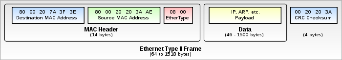
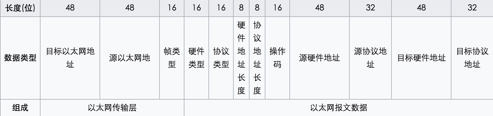
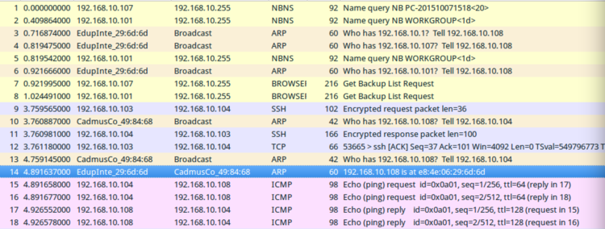
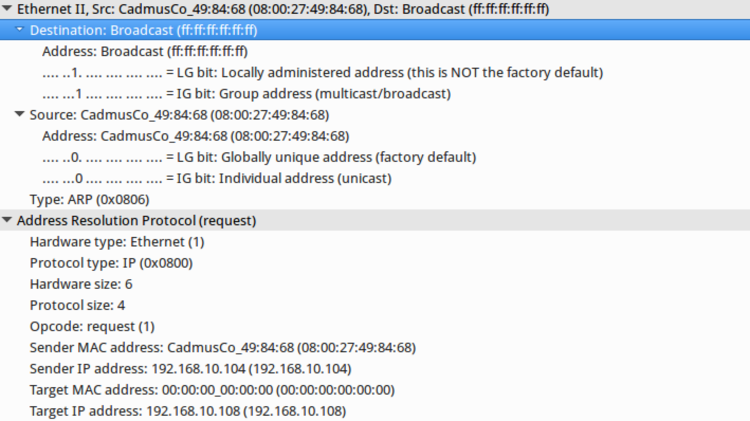
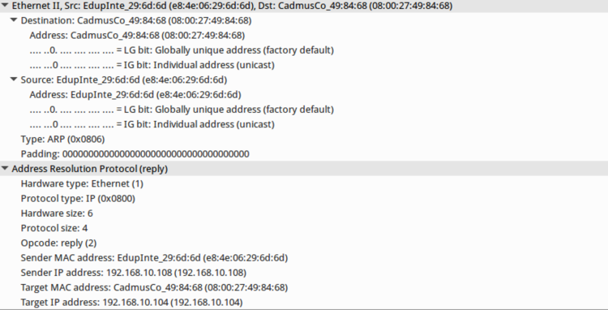

## ARP笔记

### 什么是ARP？

地址解析协议（英语：Address Resolution Protocol，ARP）是通过解析网路层地址（IP）来找寻数据链路层地址（MAC）的一个在网络协议包中极其重要的网络传输协议。

### 什么是MAC地址？

MAC地址（英语：Media Access Control Address），直译为媒体访问控制地址，也称为局域网地址（LAN Address），以太网地址（Ethernet Address）或物理地址（Physical Address），它是一个用来确认网络设备位置的地址。

MAC地址格式：

MAC地址共48位（6个字节），以十六进制表示。前24位由IEEE决定如何分配，后24位由实际生产该网络设备的厂商自行指定。

如何查看MAC地址 -- `ifconfig` 命令:

```shell
ifconfig en0
en0: flags=8863<UP,BROADCAST,SMART,RUNNING,SIMPLEX,MULTICAST> mtu 1500
  ether 80:e6:50:08:19:66
  inet6 fe80::1893:25d0:d08e:6b78%en0 prefixlen 64 secured scopeid 0x5
  inet 192.168.43.114 netmask 0xffffff00 broadcast 192.168.43.255
  nd6 options=201<PERFORMNUD,DAD>
  media: autoselect
  status: active
```

ifconfig en0 其中 en0 表示接口名称

通过Python获取 本机MAC地址：

```python
import uuid
def get_mac():
  mac_num = hex(uuid.getnode()).replace('0x', '').upper()
  mac = '-'.join(mac_num[i : i + 2] for i in range(0, 11, 2))
  return mac
print(get_mac())
```

### 为啥有了IP地址，还要MAC地址？

可以这么理解，MAC地址类似于身份证，IP地址类似于住房地址，MAC地址在网卡生产以后就固定了，而IP地址可能经常变化。

IP地址本质上是终点地址，它在跳过路由器（hop）的时候不会改变，而MAC地址则是下一跳的地址，每跳过一次路由器都会改变。这就是为什么还要用MAC地址的原因之一，它起到了记录下一跳的信息的作用。

历史原因：早期的以太网只有集线器（hub），没有交换机（switch），所以发出去的包能被以太网内的所有机器监听到，因此要附带上MAC地址，每个机器只需要接受与自己MAC地址相匹配的包。

### ARP基本功能

在以太网协议中规定，同一局域网中的一台主机要和另一台主机进行直接通信，必须要知道目标主机的MAC地址。
而在TCP/IP协议中，网络层和传输层只关心目标主机的IP地址。这就导致在以太网中使用IP协议时，数据链路层的以太网协议接到上层IP协议提供的数据中，只包含目的主机的IP地址。
于是需要一种方法，根据目的主机的IP地址，获得其MAC地址。这就是ARP协议要做的事情。
所谓地址解析（address resolution）就是主机在发送帧前将目标IP地址转换成目标MAC地址的过程。

另外，当发送主机和目的主机不在同一个局域网中时，即便的MAC地址，两者也不能直接通信，必须经过路由转发才可以。所以此时，发送主机通过ARP协议获得的将不是目的主机的真实MAC地址，而是一台可以通往局域网外的路由器的MAC地址。

### 关于以太网帧格式的说明



第一部分是以太网头(14个字节)，第二部分是上层协议所带的数据(46-1500个字节)，最后一部分是一个CRC校验和(4个字节)。
那么以太网帧长度从(14+46+4=64 到 14+1500+4=1518 不等)

以太网地址是6个字节的地址，在网卡出厂时已经固定，前三个字节(OUI)用于表示网卡由哪个厂商制造。

在Linux系统的在/usr/include/net/ethernet.h文件中，包含了以太网头的定义：

```c
/* 10Mb/s ethernet header */
struct ether_header
{
  u_int8_t  ether_dhost[ETH_ALEN];  /* destination eth addr */
  u_int8_t  ether_shost[ETH_ALEN];  /* source ether addr  */
  u_int16_t ether_type;           /* packet type ID field */
} __attribute__ ((__packed__));

```

其中 ETH_ALEN 在 /usr/include/linux/if_ether.h中定义如下：

```c
#define ETH_ALEN  6   /* Octets in one ethernet addr   */
```

可以看出以太网头部，有源地址，目的地址(都是6个字节)和以太网类型3个字段。

其中以太网类型包括以下几种:

```c
#define ETHERTYPE_PUP   0x0200      /* Xerox PUP */
#define ETHERTYPE_SPRITE  0x0500    /* Sprite */
#define ETHERTYPE_IP    0x0800    /* IP */
#define ETHERTYPE_ARP   0x0806    /* Address resolution */
#define ETHERTYPE_REVARP  0x8035    /* Reverse ARP */
#define ETHERTYPE_AT    0x809B    /* AppleTalk protocol */
#define ETHERTYPE_AARP    0x80F3    /* AppleTalk ARP */
#define ETHERTYPE_VLAN    0x8100    /* IEEE 802.1Q VLAN tagging */
#define ETHERTYPE_IPX   0x8137    /* IPX */
#define ETHERTYPE_IPV6    0x86dd    /* IP protocol version 6 */
#define ETHERTYPE_LOOPBACK  0x9000    /* used to test interfaces */
```

最常见的是ARP(0x0806)和IP(0x0800)。

### ARP报文格式

报文格式如图



关于ARP协议的包定义可以在/usr/include/net/if_arp.h中查看:

```c
#define ARPOP_REQUEST 1   /* ARP request.  */
#define ARPOP_REPLY 2   /* ARP reply.  */
#define ARPOP_RREQUEST  3   /* RARP request.  */
#define ARPOP_RREPLY  4   /* RARP reply.  */
#define ARPOP_InREQUEST 8   /* InARP request.  */
#define ARPOP_InREPLY 9   /* InARP reply.  */
#define ARPOP_NAK 10    /* (ATM)ARP NAK.  */
/* See RFC 826 for protocol description.  ARP packets are variable
   in size; the arphdr structure defines the fixed-length portion.
   Protocol type values are the same as those for 10 Mb/s Ethernet.
   It is followed by the variable-sized fields ar_sha, arp_spa,
   arp_tha and arp_tpa in that order, according to the lengths
   specified.  Field names used correspond to RFC 826.  */
struct arphdr {
    unsigned short int ar_hrd;    /* Format of hardware address.  */
    unsigned short int ar_pro;    /* Format of protocol address.  */
    unsigned char ar_hln;   /* Length of hardware address.  */
    unsigned char ar_pln;   /* Length of protocol address.  */
    unsigned short int ar_op;   /* ARP opcode (command).  */
#if 0
    /* Ethernet looks like this : This bit is variable sized however...  */
    unsigned char __ar_sha[ETH_ALEN]; /* Sender hardware address.  */
    unsigned char __ar_sip[4];    /* Sender IP address.  */
    unsigned char __ar_tha[ETH_ALEN]; /* Target hardware address.  */
    unsigned char __ar_tip[4];    /* Target IP address.  */
#endif
};
```

### ARP解析过程

假定有A(192.168.10.104 MAC地址为80:00:27:49:84:68) 和 B(192.168.10.108 MAC地址为e8:4e:06:29:6d:6d)在用同一个局域网，需要通信，过程如下：

1.A先查找ARP缓存，发现没有找到B的MAC地址缓存；
2.A发送ARP广播查询请求，对局域网内的所有主机广播，内容是192.168.10.108的主机，回答我你的MAC地址；
3.主机B收到ARP请求后，回答了A，并更新自己的ARP缓存，其他主机则不会响应A的询问；
4.当主机A收到了B的回复后，更新自己的ARP缓存。

使用实际的网络包查看过程：

先看下A(192.168.10.104)的ARP缓存

```shell
arp -a
? (192.168.10.103) 位于 80:e6:50:08:19:66 [ether] 在 eth0
? (192.168.10.106) 位于 c8:1e:e7:a1:3c:ab [ether] 在 eth0
? (192.168.10.1) 位于 d0:c7:c0:0b:cb:4a [ether] 在 eth0
```

没有B主机的信息。
我们先ping一下B，在ping之前会发ARP请求:

```shell
ping 192.168.10.108
PING 192.168.10.108 (192.168.10.108) 56(84) bytes of data.
64 bytes from 192.168.10.108: icmp_seq=1 ttl=128 time=1165 ms
64 bytes from 192.168.10.108: icmp_seq=2 ttl=128 time=156 ms
64 bytes from 192.168.10.108: icmp_seq=3 ttl=128 time=104 ms
64 bytes from 192.168.10.108: icmp_seq=4 ttl=128 time=499 ms
64 bytes from 192.168.10.108: icmp_seq=5 ttl=128 time=103 ms
64 bytes from 192.168.10.108: icmp_seq=6 ttl=128 time=4.33 ms
^C
--- 192.168.10.108 ping statistics ---
6 packets transmitted, 6 received, 0% packet loss, time 5015ms
```

现在再看A的ARP缓存:

```shell
arp -a
? (192.168.10.103) 位于 80:e6:50:08:19:66 [ether] 在 eth0
? (192.168.10.108) 位于 e8:4e:06:29:6d:6d [ether] 在 eth0
? (192.168.10.106) 位于 c8:1e:e7:a1:3c:ab [ether] 在 eth0
? (192.168.10.1) 位于 d0:c7:c0:0b:cb:4a [ether] 在 eth0
```

这时候B的信息就加入A的缓存了。

把整个过程抓包看下数据包:



在ping之前会有ARP request，就是第13个包



这里的广播地址是FF:FF:FF:FF:FF:FF，意思就是我是A(192.168.10.104)，问问大家，如果你的IP是192.168.10.108，赶紧告诉我你的MAC地址。

然后第14个包，是B(192.168.10.108)的回答:



B收到请求后的reply，告诉A(192.168.10.104)，我是B(192.168.10.108)，我的MAC地址是e8:4e:06:29:6d:6d，然后A把B的IP和MAC做一个缓存到A的主机中，这样就可以通信了。

参考： 
https://colors-blind.github.io/2017/01/21/%E7%BD%91%E7%BB%9C%E7%BC%96%E7%A8%8B-%E5%9F%BA%E6%9C%AC%E6%A6%82%E5%BF%B5/
https://www.cnblogs.com/csguo/p/7542944.html
https://en.wikipedia.org/wiki/Address_Resolution_Protocol
https://en.wikipedia.org/wiki/MAC_address
https://www.zhihu.com/question/21546408
